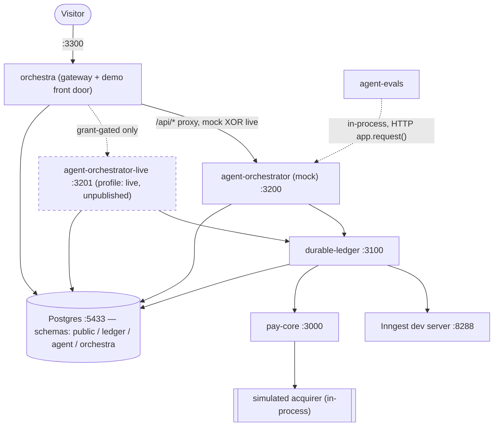
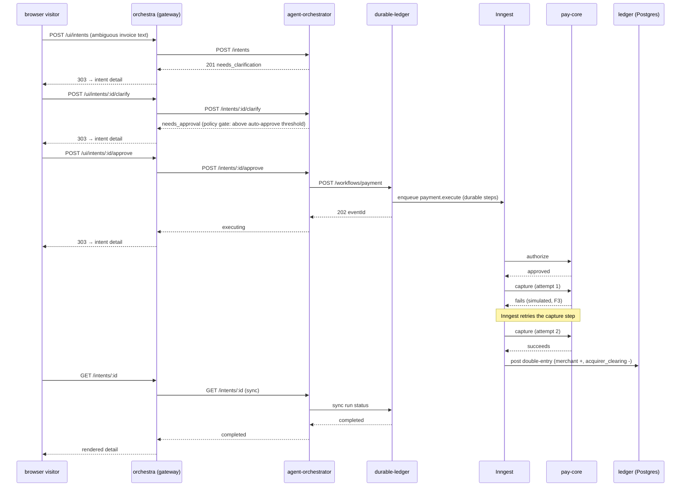

# APO — Autonomous Payment Orchestrator

[](https://github.com/infame/autonomous-payment-orchestrator/actions/workflows/ci.yml)

A portfolio system built around one thesis: **the stitch between deterministic
money-safety and an LLM's non-determinism.** An agent reasons over a
free-text payment intent ("pay the vendor for the invoice, amount's a bit
ambiguous") and proposes an action — it never moves money directly. Every
proposal passes through a deterministic policy layer (grounding checks,
approval gates, hard limits) before a durable, exactly-once execution core
touches a simulated payment provider and posts a double-entry ledger. The
agent is deliberately constrained, and that constraint is *measured*, not
just asserted — see `@apo/agent-evals` below.

This is not a real payment provider and doesn't try to be PCI-anything. The
acquirer is a simulator. The point is the architecture: hexagonal packages,
durable execution with real retries, an agent whose blast radius is bounded
by a policy layer independent of the model, and a public demo gated so it
can't run up an API bill.

Five packages, one pnpm workspace (`docs/adr/0004-monorepo-not-constellation.md`
explains why one repo, not five):

| # | Package | Role | AI inside? | README |
|---|---|---|---|---|
| 01 | `@apo/pay-core` | Deterministic payment core: transactions, idempotency, state machine, simulated acquirer | No | [packages/pay-core](packages/pay-core/README.md) |
| 02 | `@apo/durable-ledger` | Durable execution (Inngest), double-entry ledger, sagas/compensation, exactly-once | No | [packages/durable-ledger](packages/durable-ledger/README.md) |
| 03 | `@apo/agent-orchestrator` | Agent graph: intent → plan → tool calls through a deterministic policy layer (guardrails) | Yes | [packages/agent-orchestrator](packages/agent-orchestrator/README.md) |
| 04 | `@apo/agent-evals` | Adversarial eval harness: hostile scenarios, safety invariants (I1-I8), metrics, reports | Yes (as the thing being tested) | [packages/agent-evals](packages/agent-evals/README.md) |
| 05 | `@apo/orchestra` | Head package: end-to-end demo CLI, the grant-gated gateway into live-LLM mode, this front door | — | [packages/orchestra](packages/orchestra/README.md) |

## Run it

```bash
export DURABLE_LEDGER_SERVICE_SECRET="$(openssl rand -hex 32)"
docker compose up -d --build
pnpm --filter @apo/orchestra demo
```

Brings up Postgres, the Inngest dev server (dashboard at
`http://localhost:8288`), `pay-core` (`:3000`), `durable-ledger` (`:3100`),
and `agent-orchestrator` in mock-LLM mode (`:3200`). The demo CLI then drives
all three end-to-end scenarios against that stack over plain HTTP and prints
a pass/fail narration for each beat — see `packages/orchestra/README.md` for
flags, exit codes, and what each scenario proves. `docker compose --profile
live up` additionally boots a second, unpublished `agent-orchestrator-live`
instance (real `ANTHROPIC_API_KEY` required) — see
`docs/adr/0020-orchestra-gateway-and-the-second-orchestrator-instance.md` for
why a second process rather than a runtime mode switch.

For the full local live profile, export `ANTHROPIC_API_KEY`, distinct
32+-character `ADMIN_SECRET` and `GRANT_SIGNING_KEY` values, and
`PUBLIC_BASE_URL=http://localhost:3300` alongside the same
`DURABLE_LEDGER_SERVICE_SECRET`, then run
`docker compose --profile live up -d --build`. Compose passes all four
gateway/durable credentials through;
without the three grant variables the default mock stack keeps grant minting
disabled.

## Architecture



`agent-evals` drives `agent-orchestrator` in-process (it's a test harness,
the one licensed `workspace:*` import in this monorepo —
`docs/adr/0016-agent-evals-imports-the-built-orchestrator.md`); every other
arrow above is a real HTTP call between independently-runnable services.

### Browser demo surface

The gateway home page creates an intent, then redirects to that intent's
detail page. The detail page exposes clarify, approve, or reject only when
the current state permits it. Browser form handlers delegate internally to
the same `/api/*` proxy used by JSON clients, preserving grant routing,
budgets, timeouts, and header hygiene. There is no list page and no list API:
the real flow is create → detail → action, with a link back to create another
intent.

### Sequence — demo scenario A (canonical)



The CLI demo uses the same domain sequence but intentionally calls the
service ports directly (including ledger balance before/after evidence); it
does not scrape or automate the browser UI.

## Known gaps (named honestly, not hidden)

- **The `proposed` dead end (OQ1).** `Intent.autoApprove` has no production
  caller through the ordinary keyed-submission path in the shipped state —
  the demo routes around it by design (no `Idempotency-Key` on scenario A's
  first request), rather than reaching into `agent-orchestrator`'s
  already-stabilized domain/app layer to close it. See
  `packages/agent-orchestrator/README.md` and
  `docs/adr/0015-deterministic-intent-ids-for-auto-approve.md`.
- **F2 — the saga compensation path is not live-reachable.**
  `durable-ledger`'s `compensate` route is proven correct in-process
  (`payment-execute-compensation.test.ts`) but unreachable through the live
  docker-compose stack: the simulator's `capture` step can only resolve to
  success or a retryable failure, never a terminal one, so `planUnwind`
  never routes to `compensate` in practice. The demo's "cancellation"
  scenario (B) is therefore an honest orchestrator-level `reject` before any
  money moves, not the saga — narrated as such, not dressed up. See
  `docs/todo/05-orchestra.md §3` (F2) and
  `docs/adr/0020-orchestra-gateway-and-the-second-orchestrator-instance.md`.
- **No real deploy in this branch.** Fly.io/Railway configs and a runbook
  exist (`packages/orchestra/deploy/`), but nothing has actually been
  deployed — no cloud credentials are available in this environment.

## Architecture decisions

Each non-trivial, hard-to-reverse call is a short ADR in `docs/adr/`:
[0001](docs/adr/0001-record-architecture-decisions.md) ·
[0002 ports & adapters](docs/adr/0002-ports-and-adapters.md) ·
[0003 idempotency & outbox](docs/adr/0003-idempotency-and-outbox.md) ·
[0004 monorepo not constellation](docs/adr/0004-monorepo-not-constellation.md) ·
[0005 duplicate money types](docs/adr/0005-duplicate-money-across-packages.md) ·
[0006 fake pay-core in client tests](docs/adr/0006-fake-pay-core-in-client-tests.md) ·
[0007 Inngest owns the retry loop](docs/adr/0007-inngest-owns-the-retry-loop.md) ·
[0008 Inngest v4 & workflow wiring](docs/adr/0008-inngest-v4-and-workflow-wiring.md) ·
[0009 compensation routing](docs/adr/0009-compensation-routing-and-the-workflow-step-seam.md) ·
[0010 run status from Inngest](docs/adr/0010-run-status-from-inngest-not-a-workflow-runs-table.md) ·
[0011 no third money copy](docs/adr/0011-no-third-money-copy.md) ·
[0012 payment method token supplied not proposed](docs/adr/0012-payment-method-token-is-supplied-not-proposed.md) ·
[0013 optional trigger idempotency key](docs/adr/0013-optional-trigger-idempotency-key.md) ·
[0014 customer scoping without authentication](docs/adr/0014-customer-scoping-without-authentication.md) ·
[0015 deterministic intent ids for auto-approve](docs/adr/0015-deterministic-intent-ids-for-auto-approve.md) ·
[0016 agent-evals imports the built orchestrator](docs/adr/0016-agent-evals-imports-the-built-orchestrator.md) ·
[0017 merchant must be grounded](docs/adr/0017-merchant-must-be-grounded-in-the-intent-text.md) ·
[0018 live evals replay the hostile corpus](docs/adr/0018-live-evals-replay-the-hostile-corpus.md) ·
[0019 daily rate limit TOCTOU accepted risk](docs/adr/0019-daily-rate-limit-toctou-is-an-accepted-risk.md) ·
[0020 orchestra gateway & the second orchestrator instance](docs/adr/0020-orchestra-gateway-and-the-second-orchestrator-instance.md)

## Contributing / the agent-team workflow

This repo was built with a subagent pipeline (architect → implementer →
test-runner → two reviewers). See [CONTRIBUTING.md](CONTRIBUTING.md) for
that tooling, its setup, and its guardrails — it's about how the code in
this repo gets written, not about what the system does.
